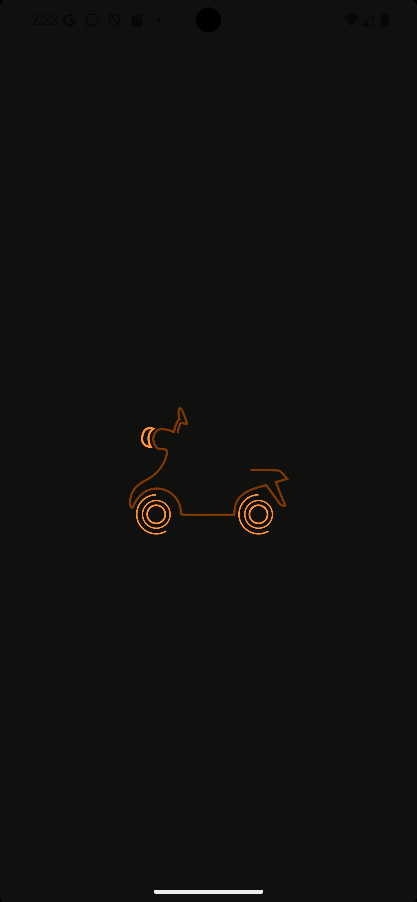
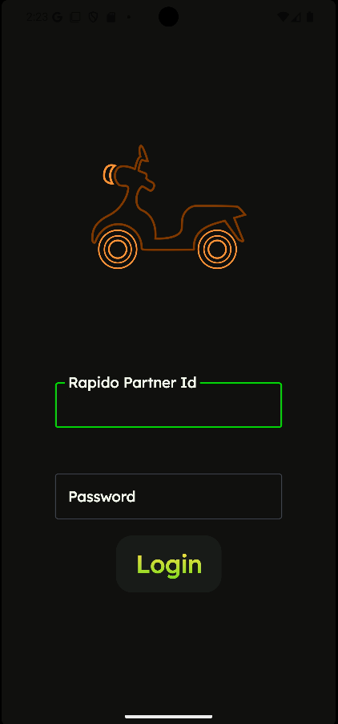
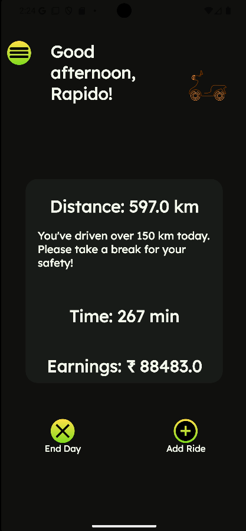
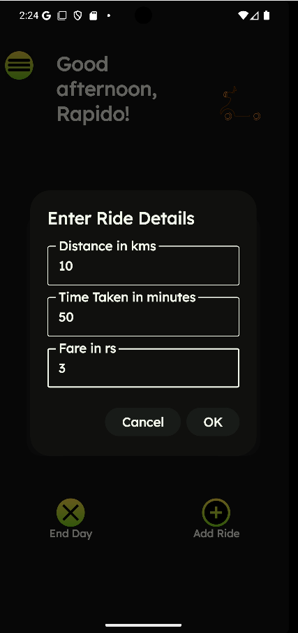
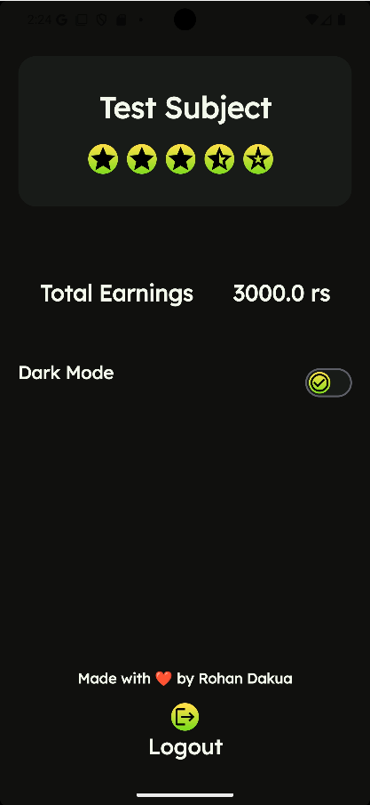
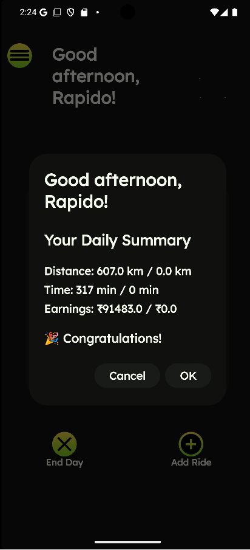

# Rapido Partner Helper App

A comprehensive Android application designed to assist Rapido partners in managing their daily operations efficiently.

Here the rapido partner can track their daily income and the distance they are driving to maintain their health. This apps make sure to remind them to care about they health also.
They can login using their account that must be provided by rapido with password. 
In future this app can integrate graphs and notifications to make it more interactive.

## Features

### 1. User Authentication
- Secure login system for Rapido partners

### 2. Ride Management
- Earnings tracking and reports

### 3. Earnings & Payments
- Detailed earnings breakdown

## Technical Implementation
- Built with Kotlin
- Clean Architecture implementation
- MVVM design pattern
- Jetpack Compose for modern UI
- Coroutines and Flow for asynchronous operations
- Room Database for local storage
- Retrofit for network calls
- Koin for dependency injection

## Demo
Check out our YouTube short demo: [Rapido Partner Helper App Demo](https://youtube.com/shorts/izKYgm1G6WI)

Use user id  -   123456
    password -   12345678    (this is to be in the firebase realtime db, no signin feature is provided)

## Screenshots

## Known Bugs
1. **Payment Processing**
   - Delayed payment status updates

2. **App Performance**
   - Memory leaks in long sessions
   - Slow loading times in poor network conditions
   - App crashes during heavy usage

3. **Overall income**
   - Overall income is to be stored in firebase (to be implemented)

4. **Null pointer Issues**
   - In some part of app there can be a Null pointer issue.

## Future Improvements
- Implement offline mode
- Add multi-language support
- Enhance security features
- Optimize battery usage
- Implement performance graphs 

## Getting Started
1. Clone the repository
2. Open in Android Studio
3. Sync Gradle dependencies
4. Build and run the app

## Requirements
- Android 8.0 (API 26) or higher
- Internet connection

## Contributing
Feel free to submit issues and enhancement requests.

## License
This project is licensed under the MIT License - see the LICENSE file for details.
